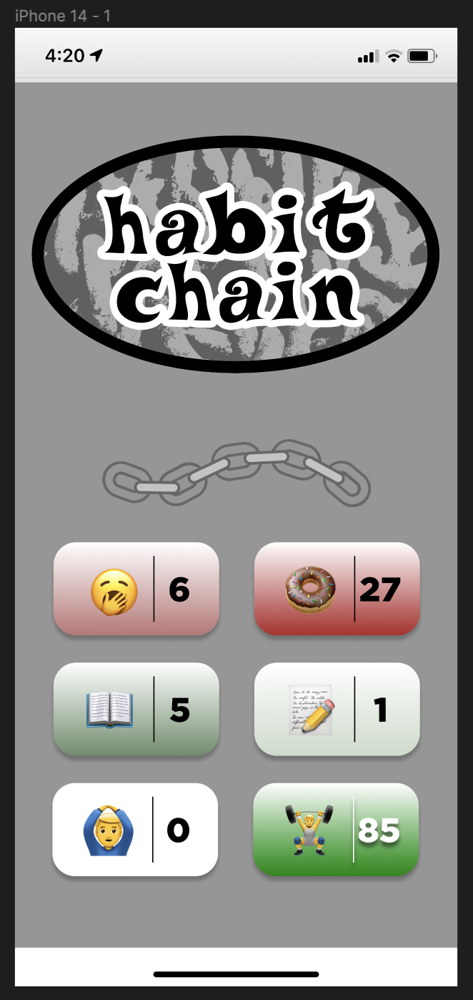

# habit-chain
<i>Makes creating good habits and breaking bad ones fun and easy</i>

## Product Vision

<b>FOR</b> the average user <b>WHO</b> wants to make creating good habits and breaking bad habits fun and easy, <b>THE</b> habit tracker app is a mobile productivity tool <b>THAT</b> gamifies habit-building/breaking using streaks. <b>UNLIKE</b> other methods or applications, OUR <b>PRODUCT</b> quantifies your progress and rewards you for keeping your streak – making the process fun and satisfying.

## About the App
<i>🔨 Work in Progress 🔨</i>

  An iOS habit tracking app that allows users to input habits that they want to create or break – inspired by apps like <i>Forest</i> and streaks in <i>Snapchat</i>, as well as the book <i>Atomic Habits</i>. 
  There is research that shows how the initial gamification of behavior drives the creation of habits, and that’s what drives the benefits of my app. Breaking the habit chain would be the unsatisfying, therefore making it easier to commit to your desired behavior.

## Mockup

